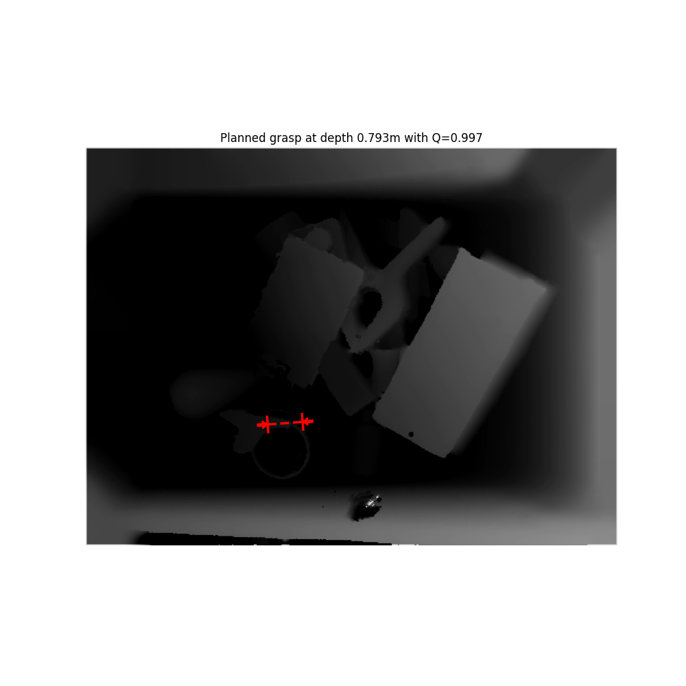

# How to run gqcnn
 Grasp Quality Convolutional Neural Networks (GQ-CNN) models is used to predict the probability of success of candidate parallel-jaw grasps on objects from point clouds. The input of GQ-CNN is a depth image and GQ-CNN could generate a Q value represent the probability of grasp success(robustenss). The model is designed by the AUTOLAB at UC Berkeley. To get more information of gqcnn, you could go to the [gqcnn official website](https://berkeleyautomation.github.io/gqcnn/index.html#academic-use).

## Installation(Docker)
We fixed the python version and the package's dependencies problem in the original environment. Hence, you could follow the bellow step to run gqcnn successfully.
1. For first time user
```
$ docker pull argnctu/gqcnn
```
2. Clone the repository
```
$ git clone https://github.com/ARG-NCTU/gqcnn.git
```
3. Go in to the gqcnn folder
```
$ cd gqcnn
```
4. Run Docker
```
$ source docker_run.sh
```
5. The root in your terminal should be similar to `root@53fdcb415bc:/gqcnn#`. if not, please ensure you are in the correct folder.
```
docker# cd gqcnn
```
After the installation you could start to run the below command to run the policy of gqcnn.

## Usage
Before running the policy, you should know that the pretrained model is stored in the folder named model in gqcnn, and the prediction result will exist in the current location(/gqcnn).
1. Run the policy
```
docker# python3 examples/policy.py FC-GQCNN-4.0-PJ --depth_image data/examples/clutter/phoxi/dex-net_4.0/depth_0.npy --segmask data/examples/clutter/phoxi/dex-net_4.0/segmask_0.png --camera_intr data/calib/phoxi/phoxi.intr --model_dir model
```
After running the policy, check the list of your current folder(gqcnn). You could see an image named `result.png` looks like the below image.
